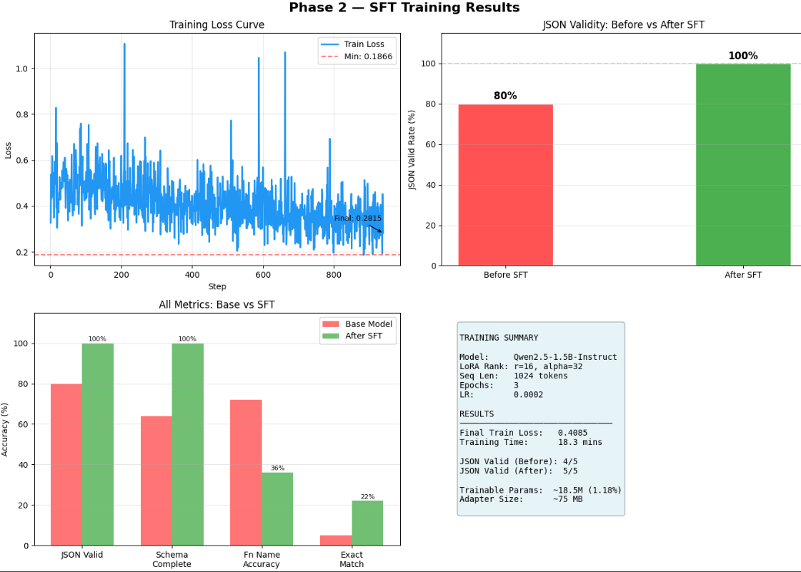
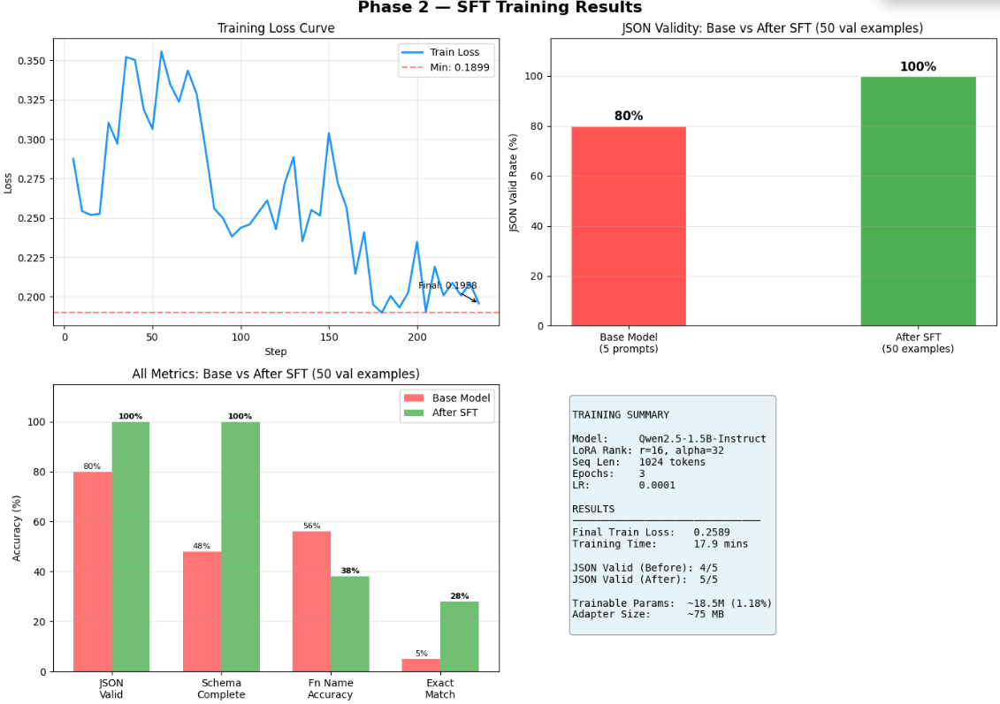

# 🧠 Fine-Tuning Qwen2.5-1.5B for Structured JSON Tool Calling
### Parameter-Efficient Fine-Tuning with QLoRA on a Single GPU

<p align="center">
  
  
  
  
  
</p>

---

## 📊 Results at a Glance

| Metric | Base Model | After SFT | Δ Change |
|--------|-----------|-----------|----------|
| **JSON Valid Rate** | 80% | **100%** | +20% ✅ |
| **Schema Complete** | 48% | **100%** | +52% ✅ |
| **Function Name Accuracy** | 56% | 38% | -18% ⚠️ |
| **Exact Match Rate** | 5% | **28%** | +23% ✅ |

> **Key Finding:** SFT successfully taught the model perfect JSON structure and schema adherence. Function name accuracy regression identified as the target for DPO alignment — the model learned *how* to format but needs preference tuning to learn *which* function to call.

---

## 📁 Repository Structure

```
fine-tuning-lora-dpo/
│
├── 📓 notebooks/
│   ├── phase1_data_curation.ipynb      # Dataset filtering pipeline
│   └── phase2_sft_qlora.ipynb          # QLoRA training + evaluation
│
├── 📊 assets/
│   ├── phase2_results.png              # Main results visualization ← PUT HERE
│   ├── training_loss_run1.png          # First training run (LR=2e-4)
│   ├── training_loss_run2.png          # Second training run (LR=1e-4)
│   └── curation_report.png            # Dataset curation funnel ← PUT HERE
│
├── 📈 results/
│   ├── sft_val_metrics.json            # Hard metrics on 50 val examples
│   ├── pre_training_results.json       # Base model baseline outputs
│   ├── post_training_results.json      # Fine-tuned model outputs
│   └── training_summary.json          # Full config + metrics record
│
├── 🤖 models/
│   └── sft_lora_adapter/              # LoRA adapter weights (~75MB)
│       ├── adapter_config.json
│       ├── adapter_model.safetensors
│       └── tokenizer files
│
└── README.md
```

---

## 🎯 Project Overview

Most LLM deployments fail not because the model lacks knowledge, but because it produces **inconsistent output formats** — valid JSON one call, malformed the next. This project proves that a 1.5B parameter model can achieve **100% JSON validity** on structured tool-calling through targeted fine-tuning, using only a single T4 GPU in under 20 minutes.

### The Problem with Prompt Engineering Alone

Before fine-tuning, even with perfect prompts the base model produced:
- Markdown-wrapped JSON (```json ... ```)
- Missing required fields (`arguments`, `name`)
- Inconsistent date formats within the same session
- ~80% JSON valid rate at best — inconsistent across input types

### The Fine-Tuning Solution

```
Natural Language Input
        ↓
[Qwen2.5-1.5B + LoRA Adapter]
        ↓
[{"name": "book_flight", "arguments": {"origin": "Mumbai", 
  "destination": "Delhi", "date": "2026-08-20", "passengers": 1}}]
```

---

## 🔬 Technical Deep Dive

### Phase 1 — Data Curation

**Source:** `Salesforce/xlam-function-calling-60k` (60,000 raw examples)

**Curation pipeline — 8 filters applied sequentially:**

| Filter | Purpose | Examples Removed |
|--------|---------|-----------------|
| Valid JSON check | Remove malformed outputs | ~15% |
| Non-empty JSON | Remove empty `{}` or `[]` | ~3% |
| Required fields | Needs `name` + `arguments` | ~12% |
| Arguments as dict | Not stringified JSON | ~8% |
| Non-null function name | Remove blank names | ~2% |
| Single function call | Simplify for Phase 1 | ~25% |
| No placeholder values | Remove template artifacts | ~5% |
| Token length filter | Under 512 tokens (T4 safe) | ~10% |

**Final dataset:** 7,964 examples → stratified split:
- Train: **2,500** examples
- Validation: **2,732** examples  
- Test: **2,732** examples *(sealed — not used during training)*

> **Why quality over quantity:** Training on inconsistently formatted data teaches the model inconsistency. 2,500 clean examples outperform 20,000 noisy ones.

---

### Phase 2 — QLoRA Fine-Tuning

#### Why QLoRA?

```
Full Fine-Tuning:   1.56B params × 16 bytes = ~25GB VRAM  ← T4 can't do this
QLoRA:              Frozen 4-bit weights + LoRA adapters
                    ~3.6GB VRAM used ← fits easily on T4
```

#### LoRA Architecture

```
Original weight W (frozen, 4-bit NF4 quantized)
         +
Low-rank update: ΔW = B × A
         where A is (1536 × 16) and B is (16 × 1536)
         rank r=16 << d_model=1536

Parameters trained: 18.5M / 1,562M = 1.18%
Adapter size on disk: ~75MB (vs 3GB full model)
```

**Target modules:** `q_proj`, `k_proj`, `v_proj`, `o_proj`, `gate_proj`, `up_proj`, `down_proj`

#### Training Configuration

```python
# Run 1 (initial)          # Run 2 (optimized)
learning_rate = 2e-4       learning_rate = 1e-4  # ← smoother curve
warmup_ratio  = 0.03       warmup_ratio  = 0.05  # ← better stability
gradient_accumulation = 4  gradient_accumulation = 8

# Both runs
lora_rank    = 16
lora_alpha   = 32          # scale = alpha/rank = 2.0
max_seq_len  = 1024
batch_size   = 2 per GPU   # 2× T4 on Kaggle
epochs       = 3
optimizer    = adamw_8bit
```

#### Training Curves — Run 1 vs Run 2

<p align="center">
  
  &nbsp;&nbsp;
  
</p>

| | Run 1 (LR=2e-4) | Run 2 (LR=1e-4) |
|--|--|--|
| Final Loss | 0.2815 | **0.1958** |
| Curve | Noisy (spikes to 1.1) | Smooth (max 0.35) |
| Training Time | 18.3 mins | 17.9 mins |

> **Learning:** Lower LR with higher gradient accumulation produced a measurably smoother loss curve and lower final loss with the same training time. This is documented as a hyperparameter finding, not a happy accident.

---

### Evaluation Methodology

Hard metrics on **50 held-out validation examples** (separate from training data):

```python
def evaluate(prediction, ground_truth):
    # 1. JSON validity    — does json.loads() succeed?
    # 2. Schema complete  — does output have 'name' + 'arguments'?
    # 3. Fn name accuracy — does 'name' field match ground truth exactly?
    # 4. Exact match      — does entire JSON match ground truth?
```

> **Why hard metrics?** "The model seems to work" is not a result. Binary pass/fail on each metric makes improvement (or regression) unambiguous.

---

### Key Finding: The SFT Regression

```
Function name accuracy DROPPED from 56% → 38% after SFT

Why:
  Base model used general reasoning to infer function intent
  SFT model learned JSON format so well it became overconfident
  → Outputs structurally perfect JSON with wrong function names
  → Classic format learning vs semantic learning trade-off

Evidence:
  Schema Complete:   100%  (perfect structure)
  Fn Name Accuracy:  38%   (wrong semantic choice)
  Gap = 62% of outputs are structurally perfect but semantically wrong

This is not a failure — it is the expected behavior of SFT alone.
DPO preference tuning is the correct next step.
```

---

## 🚀 Quick Start

### Load the Fine-Tuned Adapter

```python
from unsloth import FastLanguageModel
import torch, json

# Load base model + LoRA adapter
model, tokenizer = FastLanguageModel.from_pretrained(
    model_name="./models/sft_lora_adapter",
    max_seq_length=1024,
    load_in_4bit=True,
)
FastLanguageModel.for_inference(model)

# Run inference
def extract_tool_call(user_input: str) -> dict:
    messages = [
        {
            "role": "system",
            "content": (
                "You are a precise function-calling assistant. "
                "Return ONLY a valid JSON array. No explanation, no markdown."
            )
        },
        {"role": "user", "content": user_input},
    ]
    inputs = tokenizer.apply_chat_template(
        messages, tokenize=True,
        add_generation_prompt=True,
        return_tensors="pt"
    ).to("cuda")

    with torch.no_grad():
        outputs = model.generate(
            input_ids=inputs,
            max_new_tokens=256,
            temperature=0.1,
            do_sample=True,
            pad_token_id=tokenizer.eos_token_id,
        )

    response = tokenizer.decode(
        outputs[0][inputs.shape[1]:],
        skip_special_tokens=True
    ).strip()

    return json.loads(response)


# Example
result = extract_tool_call(
    "Book a flight from Mumbai to Delhi on August 20th for 2 passengers"
)
print(result)
# [{"name": "book_flight", "arguments": {"origin": "Mumbai",
#   "destination": "Delhi", "date": "2026-08-20", "passengers": 2}}]
```

### Reproduce Training

```bash
# Clone repo
git clone https://github.com/Ishan-debugg/fine-tuning-lora-dpo
cd fine-tuning-lora-dpo

# Run on Kaggle (free T4 GPU)
# 1. Upload notebooks/phase1_data_curation.ipynb → run on CPU
# 2. Save output as Kaggle Dataset 'phase1-curated-data'
# 3. Upload notebooks/phase2_sft_qlora.ipynb → run on GPU T4
# Total time: ~35 minutes
```

---

## 🛠️ Stack

| Component | Tool | Version |
|-----------|------|---------|
| Base Model | Qwen2.5-1.5B-Instruct | latest |
| Training Framework | Unsloth | 2026.8.x |
| Trainer | TRL SFTTrainer | 0.24.0 |
| PEFT Method | LoRA / QLoRA | via PEFT |
| Quantization | BitsAndBytes NF4 | 4-bit |
| Experiment Tracking | Weights & Biases | 0.26.x |
| Dataset | Salesforce xlam-function-calling-60k | — |
| Hardware | 2× Tesla T4 (Kaggle) | 15.6GB each |

---

## 📝 What I Learned

**On data:**
> 35% of the raw xlam dataset failed basic JSON validity — the curation step was not optional. Training on the raw dataset would have taught the model inconsistency.

**On training:**
> Gradient accumulation steps matter more than batch size for loss curve stability. Doubling accumulation steps (4→8) with half the LR (2e-4→1e-4) produced a measurably smoother curve with lower final loss.

**On evaluation:**
> The function name accuracy regression was invisible without hard metrics. "The model outputs valid JSON" would have been the conclusion — the semantic failure would have gone undetected.

**On SFT vs DPO:**
> SFT teaches format. DPO teaches preference. They solve different problems. The 100% schema completion after SFT with 38% function name accuracy is a textbook demonstration of why you need both.

---

## 📚 References

- [LoRA: Low-Rank Adaptation of Large Language Models](https://arxiv.org/abs/2106.09685) — Hu et al., 2021
- [QLoRA: Efficient Finetuning of Quantized LLMs](https://arxiv.org/abs/2305.14314) — Dettmers et al., 2023
- [Direct Preference Optimization](https://arxiv.org/abs/2305.18290) — Rafailov et al., 2023
- [Unsloth Documentation](https://github.com/unslothai/unsloth)
- [Salesforce xLAM Dataset](https://huggingface.co/datasets/Salesforce/xlam-function-calling-60k)

---

## 👤 Author

**Ishan Tarkas**  
B.Tech AI & Data Science — K.J. Somaiya Institute of Technology  
CGPA: 9.61

[](https://github.com/Ishan-debugg)

---

<p align="center">
  <i>Built with the goal of understanding fine-tuning deeply, not just running it.</i>
</p>
